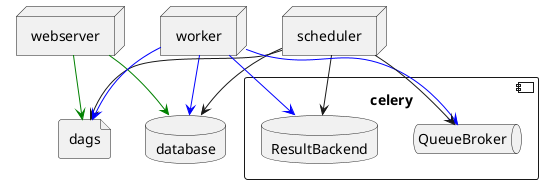

[](https://opensource.org/licenses/BSD-3-Clause)

# ZExtensions (fork of PPExtensions)


# Features

- **Notebooks Scheduling** - A jupyter extension to productionalize the notebooks development environment. This extension enables scheduling notebooks with help of [Apache Airflow](https://airflow.apache.org/).

# Airflow Scheduler 

# About
A Jupyter extension to productionalize your notebooks by scheduling them to run in the background

### Local Environment Setup

#### Pre Requisites

**Configure Airflow**
```
export AIRFLOW_HOME=<path to airflow_home>
export AIRFLOW_SCHEDULER_AIRFLOW_WEB_URL='http://airflow:8080'
```

Run airflow in command line, a `airflow.cfg` file will be generated in airflow home. Here is a list of parameters which needs to be changed.

```
dags_folder = <path to airflow home>/dags
executor = LocalExecutor
sql_alchemy_conn = mysql+mysqlconnector:://<user name>:<password>@<host>:<port>/airflow
dags_are_paused_at_creation = False (recommended)
load_examples = False (recommended)
```

Create a `dags` and a `variables` folder in airflow home to store the dag files and their related vairable files.

**Setup MySQL Database**

Create a database `airflow` in mysql. This serves as the metadata db for airflow.

#### Local Setup

Here are a few preparations to make scheduler extension work. The Pre-req steps can be skipped with those are already configured.

#### Cluster Setup (see Appendix)

**Start Airflow Scheduler, Webserver**

In this tutorial, we are using airflow LocalExecutor, hence airflow worker is not required. But if you are using some other executors like CeleryExecutor, then the airflow worker should also be started. 

```
airflow initdb
airflow webserver
airflow scheduler 
```

By default, the log files will be generated in airflow_home, you can configure that as well. Refer to https://airflow.apache.org/howto/write-logs.html.

#### Install Airflow Scheduler Extension

```
pip install --user --extra-index-url https://pypi.anaconda.org/zouth/simple zextensions
jupyter nbextension install airflow_scheduler --py --user
jupyter nbextension enable airflow_scheduler --py --user
jupyter serverextension enable airflow_scheduler --py --user 
```


### Schedule Notebook

To schedule a notebook, first select a notebook, click on the `schedule` button appeared in the dynamic tool bar, a scheduler menu will pop up. 

Currently scheduler extension provides the following configurable dag parameters:

***Interval:*** Three different scales of frequency are provided: hourly, daily and weekly. 

***Start Time/Date:*** The start time/date can not be ealier than current time.  

***Number of Runs:*** The number of runs the job should be executed. For example, if a job is scheduled to at `12:00AM 11/11/2018` with an interval of `1 hour`, and the number of runs is set to 5 times, then the job will be ended at `5:00 AM 11/11/2018`. 

***Emails:*** To receive failure email and success email, check the box and input the email address in the input area. 

To receive the email alert, the STMP server should be setup in the host machine and corresponding parameters in `airflow.cfg`  `[smtp]` section need to be configured.

Click on `Schedule` button, the job will be displayed in `Scheduled Jobs` tab, from which you can see the **Last Run Time**, **Last Run Time**, **Last Run Duration**, **Next Scheduled Run** of each job scheduled. Notice, there will be some delay in the airflow UI to show the job.

### Edit Job

To edit a job, go to the `Scheduled Jobs` tab, click on `Edit` button in `Action` column of the target job, the current configuration of that job except number of runs will be displayed in the configuration menu as default values.  Change the configuration and hit on `Confirm Edit` button, the changes will be applied to the job.


### Delete Job

To delete a job, go to the `Scheduled Jobs` tab, click on `Remove` button in `Action` column of the target job, the dag/vairable file of the related job as well as the records in the metadata db will be removed. 


# Appendix I: Cluster Setup
Airflow in Cluster mode required additional setup.

# Architecture



- edit environment for jupyter notebook `/opt/tljh/config/jupyterhub_config.d/environment.py`
```
c.Spawner.environment = {
  'AIRFLOW_HOME': '/opt/bitnami/airflow',
  'AIRFLOW_SCHEDULER_AIRFLOW_WEB_URL': 'http://172.16.14.18:8080'
}
```

- reload jupyterhub 
```
tljh-config reload
tljh-config reload proxy
```

- create `dags`, `variables`, and `shared_notebooks` directory in `AIRFLOW_HOME`
```
set -u
mkdir -p ${AIRFLOW_HOME}/{dags,variables,shared_notebooks}
chown -R nobody:root /opt/bitnami/airflow/shared_notebooks
chmod -R g+rwxs /opt/bitnami/airflow/shared_notebooks
setfacl -d -m group::rwx /opt/bitnami/airflow/shared_notebooks

```
- create symbolic link for shared_notebook
```
# create notebook folder for specific user
sudo mkdir /opt/bitnami/airflow/shared_notebooks/<username>
sudo chown -R <username>:root /opt/bitnami/airflow/shared_notebooks/<username>
ln -s /opt/bitnami/airflow/shared_notebooks/<username> ${HOME}/shared_notebooks
```
- mount sshfs
```
mkdir -p /root/docker/mnt/airflow
sudo sshfs -o allow_other,default_permissions root@172.16.14.17:/opt/bitnami/airflow /root/docker/mnt/airflow

mkdir -p /opt/bitnami/airflow/shared_notebooks
sudo sshfs -o allow_other,default_permissions root@172.16.14.17:/opt/bitnami/airflow/shared_notebooks /opt/bitnami/airflow/shared_notebooks

